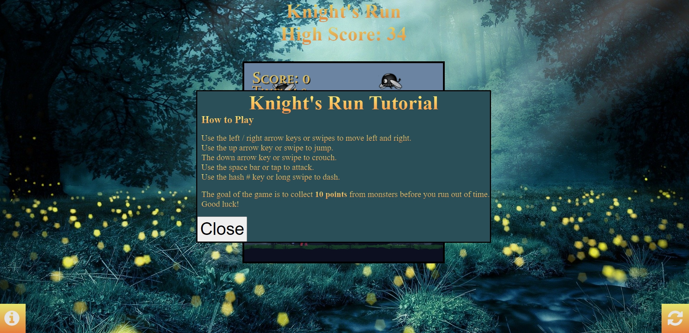
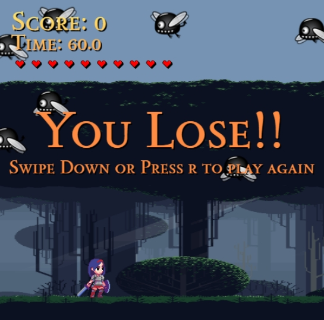

# [KNIGHT'S RUN](https://patrickaod.github.io/KnightsRun)

[](https://github.com/patrickaod/KnightsRun/commits/main)
[](https://github.com/patrickaod/KnightsRun/commits/main)
[](https://github.com/patrickaod/KnightsRun)

---


KNIGHT’S RUN,
a scenic interactive indie side-scroller that follows a player-controlled character trying to escape the **Endless Night Wood**. The player will face multiple enemy types along their journey until their time runs out. Utilising OOP to make player and enemy states easily maintainable across multiple JS files. Key features include a parallax background, collision detection, and touch controls. Achieved with the Canvas and HTML DOM API, and built with HTML5, CSS3, and vanilla JavaScript. I’m proud to deliver this more than 100-hour lexically scoped project. 


## UX

Making a game is one of the best ways to showcase a prowess in JavaScript. Due to time constraints, I needed to make a game that wasn't too resource-intensive, too complicated, or require too many dependencies. Ruling out 3D games, RPGs, and deck builders. Leaving me with a selection of 2D game ideas. I chose to make a side-scroller because it was simple, yet complicated enough for me to showcase my skills. 

The game design was made around a suitable player character. Once a viable character was found I added details until I created the **Endless Night Wood**.

Using online tutorials made this process a lot easier, and enabled me to give this game the polish it deserves. I'm very proud of this accomplishment. 

### Colour Scheme

As stated above, the game design was centered around a viable player character. The background asset that worked best was a [woodland parallax](). To give a greater depth to the pixelated parallax I added a beautiful woodland image.


Extracting the colour scheme through [Coolor.co](https://coolors.co/image-picker) image picker. Produces this colour scheme: 


The produced colour scheme was very homogenous. I wanted to add more contrast to this palette. Unfortunately, due to pricing constraints, only five colours can appear on one colour palette with Coolor.co.
I removed the two colours of least importance #396C71,and #091E28, and added the main contrasting colour of the background Icterine (#F6F451). I then began a search for another complementary contrasting colour, and ended up with this colour palette:


I then used Icterine (#F6F451) & Pumpkin (#FF7518) for all the game's UI elements. Generally, applied in a 180&deg; CSS3 linear gradient. For example, the title banner:


The tutorial and restart buttons use the same gradient, but increases the Icterine (#F6F451) value from 0% to 33% to emphasize hovering. The white font-awesome icons help add contrast to the buttons, as seen below:


The information modal that displays from the infomration icon continues the linear backgorund effect, but also uses the main color found in the background pallete Dark slate - #2B4F59 as the background. The button is kept as default to keep contrast. Please see below:



The internal game UI uses javascript through the Canvas API to display it's contents, so a different technique had to be implemented to achieve a similar effect. Utilising the Canvas API's createLinearGradient(), addColorStop(), and fillStyle(), I was able to manipulate the game object to resemble the required effect, as seen below:




### Typography

A Knight in the Woods reminds me of Robin Hood, and for that reason, I chose typography to support a more medieval idea. 

#### Font

A serif font is a great choice for the medieval aspect. More specifically, a titling serif would add extra punch to the limited text a player would see. 

[Sedan SC](https://fonts.google.com/specimen/Sedan+SC?stroke=Serif) was the best choice, as the font offered the most emphasis out of the Google serif fonts.

Other quirkier fonts like [Jacquarda Bastarda 9 Charted](https://fonts.google.com/specimen/Jacquarda+Bastarda+9+Charted?stroke=Serif) were interesting choices but weren't quite as well fitting.

Serif was chosen as a redundant font in case Google couldn't be reached. 

#### Icons 

To reduce the game UI from obscuring the background a helpful [information circle](https://fontawesome.com/v4/icon/info-circle) from Font Awesome was added to alert the user of the controls.

Finally, a [fallen Leaf](https://favicon.io/emoji-favicons/fallen-leaf/) favicon was added to give the project a more charming effect but still tie into the old-time nature theme.

## User Stories

### New Site Users

- As a new site user, I would like to start playing immediately, so that I can enjoy myself.
- As a new site user, I would like to see my score, so that I can feel proud I scored high.
- As a new site user, I would like to I would like my progress to be saved, so that I can continue later.
- As a new site user, I would like to be able to play on both PC, laptop, and mobile, so that I can take it anywhere.
- As a new site user, I would like the controls to be easy to understand and use so that I can quickly start to play.

### Returning Site Users

- As a returning site user, I would like to see my score from last time, so that I can continue to try and beat it.
- As a returning site user, I would like the enemy types to change, so that the game can feel fresh.
- As a returning site user, I would like to just run through the game, so that I can try different strategies.

## Wireframes

To follow best practices, wireframes were developed for mobile, tablet, and desktop sizes.
I've used [Balsamiq](https://balsamiq.com/wireframes) to design my site wireframes.

### Mobile Wireframes

<details>
<summary> Click here to see the Mobile Wireframes </summary>

Game Area with tutorial box 
  - 

Game Area with tutorial icon
  - 

</details>

### Tablet Wireframes

<details>
<summary> Click here to see the Tablet Wireframes </summary>

Game Area with tutorial box 
  - 

Game Area with tutorial icon
  - 


</details>

### Desktop Wireframes

<details>
<summary> Click here to see the Desktop Wireframes </summary>

Game Area with tutorial box 
  - 

Game Area with tutorial icon
  - 

</details>

## Features

### Existing Features

- **Highscore**

    - The highScore function uses the `localStorage()` window object to store and retrieve the player's best score. The feature is manipulated by the `getElementByID()` method. It gives a lot to the replayability of the site. 


- **Tutorial Icon**

    - After the page is loaded, this button can be clicked an unlimited amount of times to show the player what to do. It used also manipulated with the `getElementByID()` and `addEventListener("click", function(){})` methods.


- **Player States**

    - The player states are managed by one file, which is called by other js files to be animated, checked, or affected. The file uses OOP structuring to make maintainability easier over time. Each player state is entered into an enum that can be selected dependening on the current state's input method. The lexically scoped approach makes adding new states easier, and removes the need for "spaghetti code".
    


- **Enemies**

    - The game uses three different enemy assets to challenge the player. To win this game the player must achieve a certain score by killing enemies in a given time. There is one constructor with the enemy's general settings. Then there are subsequent classes that use the `super()` method to inherit previous properties. The unique mob is passed to be `draw()` method to be selected and called to the main game canvas, dependent on a function in the main.js file called `addEnemy()`.


- **Parallax Background**

    - The background shifts at different speeds depending on the game speed. Each layer is assigned a speed modifier. The one closer to the front has a higher value. If the player stops moving so too does the background. Adding a new dimension of detail to the game.


- **Key/Swipe Controls**

    - The key input wait for the `addEventListener()` to fire on 'keydown'. Using es6 notation the fat arrow points to an if statement of inputs ready to be placed in an array. These keys are then removed using `splice()` on the keyup. The same is true for the touch controls.

```js
window.addEventListener('keydown', e => {
            if ((e.key === 'ArrowDown' ||
                e.key === 'ArrowUp' ||
                e.key === 'ArrowLeft' ||
                e.key === 'ArrowRight' ||
                e.key === ' ' || 
                (e.key === '#'  && !this.game.cooldown)
            ) && this.keys.indexOf(e.key) === -1) {
                this.keys.push(e.key);
            } else if (e.key === 'd') this.game.debug = !this.game.debug;
            else if (e.key === 'r' && this.game.gameOver) game.restartGame();
        });
        // On key up remove to this.keys array
        window.addEventListener('keyup', e => {
            if (e.key === 'ArrowDown' ||
                e.key === 'ArrowUp' ||
                e.key === 'ArrowLeft' ||
                e.key === 'ArrowRight' ||
                e.key === ' ' ||
                e.key === '#') 
            {
                this.keys.splice(this.keys.indexOf(e.key), 1);
            } 
        });
```
The touch controls fat arrow points to a javascript object called changedTouches where the x and y coordinates are stored. These are then used the same way to add (touchstart), change(touchmove), and remove (touchend).
```js
 // On press down register touch X & Y
        window.addEventListener('touchstart', e => {
            this.touchX = e.changedTouches[0].pageX;
            this.touchY = e.changedTouches[0].pageY;  
        });
        // The difference to the inital position indicates the swipe
        window.addEventListener('touchmove', e => {
            // Jump
            const swipeDistance = e.changedTouches[0].pageY - this.touchY;
            if( swipeDistance < -this.touchTreshold && this.keys.indexOf('swipe up') === -1){
                this.keys.push('swipe up');}
                // Reset
            else if(swipeDistance > this.touchTreshold && this.keys.indexOf('swipe down') === -1){
                this.keys.push('swipe down');   
                if (this.game.gameOver) {this.game.restartGame()};
            }
            //Running
            const swipeDistanceX = e.changedTouches[0].pageX - this.touchX;
            if( swipeDistanceX > this.touchTreshold && this.keys.indexOf('swipe right') === -1)
                {this.keys.push('swipe right');}
            else if (swipeDistanceX < -this.touchTreshold && this.keys.indexOf('swipe left') === -1)
                {this.keys.push('swipe left');}
            else if( swipeDistanceX > this.dashTreshold && this.keys.indexOf('long swipe') === -1)
                {this.keys.push('long swipe');}
            else if( swipeDistanceX < -this.dashTreshold && this.keys.indexOf('long swipe') === -1)
                {this.keys.push('long swipe');}
            //Attack
               if ((swipeDistanceX < -this.atkTreshold || swipeDistanceX >this.atkTreshold) && this.keys.indexOf('tap') === -1){
                  this.keys.push('tap')
              } else if ((swipeDistance < -this.atkTreshold || swipeDistance > this.atkTreshold) && this.keys.indexOf('tap') === -1 ){
                  this.keys.push('tap');
             }  else {
                 this.keys.splice(this.keys.indexOf('tap'), 1)
             }
            console.log(this.keys);
        });
        // On end remove touch event from this.keys
        window.addEventListener('touchend', e => {
            this.keys.splice(this.keys.indexOf('tap'), 1)
            this.keys.splice(this.keys.indexOf('swipe up'), 1)
            this.keys.splice(this.keys.indexOf('swipe down'), 1)
            this.keys.splice(this.keys.indexOf('swipe right'), 1)
            this.keys.splice(this.keys.indexOf('swipe left'), 1)
            this.keys.splice(this.keys.indexOf('long swipe'), 1)
        });
```
- **UI**

    - The UI provides the user with relevant information about their current game such as score, time, and life. At the end of the game, a win-or-lose message appears concluding the game. The messages are drawn between the `context.save()` & `context.restore()` methods. These methods keep any changes made to values within the file. The CANVAS API shadow variable is used here to add a white shadow, although this was handled differently in the flaotingmessages.js file. 


- **Floating Messages**

    - The floating numbers float towards a given x and y position at a given speed, in this case, 3% game speed. The image is taken at 0.1% speed. The floatingmessages.js file doesn't use the CANVAS API shadow variable as it is slightly more performant to just double the text with a slight offset. 


- **Attack Radius**

    - The attack radius of the character will be very important to the player, so it's set to the maximum point of the animation. As seen below. If the player were to attack the enemy plant would be marked for deletion and then removed using the array `filter()` method from the main game file with another animation from the collisionAnimation.js file. The reason `filter()` is used instead of splice is so the enemy can be removed in the same loop as the animation is running, otherwise, it leads to stuttering. 


- **Collision**

    - The character hitbox has shrunken to the width of the player, but it is not yet dynamic. The code below show shows how this was achieved. The .hasCollided() function prevents multiple hits from the same enemy, avoiding insta-death, and how -1 floatingmessages are fired. The new object is routed through the main game file because the class is exported and imported by the main.js file. Centralising all the code for easy maintainability. 

```js
    checkCollision() {
        this.game.enemies.forEach(enemy => {
            // Hitbox Collision
            else if (
                enemy.x < (this.x + 40) + (this.width * 0.22) &&
                enemy.x + enemy.width > (this.x + 40) &&
                enemy.y < (this.y + 5) + (this.height - 5) &&
                enemy.y + enemy.height > (this.y + 5) && 
                !enemy.hasCollided
            ) {
                enemy.hasCollided = true;
                this.setState(6, 0);
                this.game.score -= 1;
                this.game.floatingMessages.push(new FloatingMessages('-1', enemy.x, enemy.y, 180, 50));
                this.game.hearts--;
                if (this.game.hearts <= 0) this.game.gameOver = true;
            }
        });
    }
```
### Future Features

- Pixel perfect hitboxes 
- Local multiplayer
- More enemy types & movement patterns 
- Platforming 
- Campaign 
- Animation sequences 

## Tools & Technologies Used

- [](https://tim.2bn.dev/markdown-builder) used to generate README and TESTING templates.
- [](https://git-scm.com) used for version control. (`git add`, `git commit`, `git push`)
- [](https://github.com) used for secure online code storage.
- [](https://code.visualstudio.com) used as my local IDE for development.
- [](https://en.wikipedia.org/wiki/HTML) used for the main site content.
- [](https://en.wikipedia.org/wiki/CSS) used for the main site design and layout.
- [](https://www.javascript.com) used for user interaction on the site.
- [](https://pages.github.com) used for hosting the deployed front-end site.
- [](https://jestjs.io) used for automated JavaScript testing.
- [](https://balsamiq.com/wireframes) used for creating wireframes.
- [](https://fontawesome.com) used for the icons.
- [](https://www.grammarly.com/) used for spellchecking.
- [](https://www.tabnine.com/) used for comments.
- [](https://developer.mozilla.org/en-US/docs/Web/API/Canvas_API) used to draw game assets.
- [](https://developer.mozilla.org/en-US/docs/Web/API/HTML_DOM_API) used to collect and alter html elements.

## Testing
> [!NOTE]  
> For all testing, please refer to the [TESTING.md](TESTING.md) file.

## Deployment

The site was deployed to GitHub Pages. The steps to deploy are as follows:

- In the [GitHub repository](https://github.com/patrickaod/KnightsRun), navigate to the Settings tab 
- From the source section drop-down menu, select the **Main** Branch, then click "Save".
- The page will be automatically refreshed with a detailed ribbon display to indicate the successful deployment.

The live link can be found [here](https://patrickaod.github.io/KnightsRun)

### Local Deployment

This project can be cloned or forked in order to make a local copy on your own system.

#### Cloning

You can clone the repository by following these steps:

1. Go to the [GitHub repository](https://github.com/patrickaod/KnightsRun) 
2. Locate the Code button above the list of files and click it 
3. Select if you prefer to clone using HTTPS, SSH, or GitHub CLI and click the copy button to copy the URL to your clipboard
4. Open Git Bash or Terminal
5. Change the current working directory to the one where you want the cloned directory
6. In your IDE Terminal, type the following command to clone my repository:
	- `git clone https://github.com/patrickaod/KnightsRun.git`
7. Press Enter to create your local clone.

Alternatively, if using Gitpod, you can click below to create your own workspace using this repository.

[](https://gitpod.io/#https://github.com/patrickaod/KnightsRun)

Please note that in order to directly open the project in Gitpod, you need to have the browser extension installed.
A tutorial on how to do that can be found [here](https://www.gitpod.io/docs/configure/user-settings/browser-extension).

#### Forking

By forking the GitHub Repository, we make a copy of the original repository on our GitHub account to view and/or make changes without affecting the original owner's repository.
You can fork this repository by using the following steps:

1. Log in to GitHub and locate the [GitHub Repository](https://github.com/patrickaod/KnightsRun)
2. At the top of the Repository (not top of page) just above the "Settings" Button on the menu, locate the "Fork" Button.
3. Once clicked, you should now have a copy of the original repository in your own GitHub account!

### Local VS Deployment

The local deployment of a website exists on a developer's computer during the development phase, where changes and testing occur. The live deployment of a website refers to the process of making the finalized and tested website live on a web server for public access. The local environment is a controlled and private space for development, while the deployment is the public-facing version of the website.

## Credits

### Content

| Source | Location | Notes |
| --- | --- | --- |
| [Markdown Builder](https://tim.2bn.dev/markdown-builder) | README and TESTING | tool to help generate the Markdown files |
| [Chris Beams](https://chris.beams.io/posts/git-commit) | version control | "How to Write a Git Commit Message" |
| [freeCodeCamp.org in association with Frankslaboratory ](https://www.youtube.com/watch?v=GFO_txvwK_c&ab_channel=freeCodeCamp.org) | game area | JavaScript Game Development Course for Beginners |
| [W3Schools](https://www.w3schools.com/jsref/prop_win_localstorage.asp) | index page | Window `localStorage()` tutorial |
| [W3Schools](https://www.w3schools.com/jsref/tryit.asp?filename=tryjsref_win_localstorage2) | index page | Window `localStorage()` example |
| [stack overflow](https://stackoverflow.com/questions/1841452/new-line-in-javascript-alert-box) | index page | New line in JavaScript alert box |
| [GeeksForGeeks](https://www.geeksforgeeks.org/how-to-create-linear-gradient-text-using-html-and-css/) | index page | How to create linear gradient text using HTML and CSS ? |
| [W3Schools](https://www.w3schools.com/js/js_array_methods.asp) | game area | JavaScript Array Methods |
| [W3Schools](https://www.w3schools.com/js/js_htmldom_collections.asp) | game area | JavaScript HTML DOM Collections |
| [W3Schools](https://www.w3schools.com/jsref/api_canvas.asp) | game area | Canvas API |
| [cssgradient](https://cssgradient.io/) | index page | linear gradient generator |
| [Web Dev Simplified](https://https://www.youtube.com/watch?v=ywtkJkxJsdg&ab_channel=WebDevSimplified.io/) | index page | Tutorial button with modal functionality |


### Media

| Source | Location | Type | Notes |
| --- | --- | --- | --- |
| [edermunizz @ itch.io](https://edermunizz.itch.io/free-pixel-art-forest) | game area  | image | pixel art forest for parallax background |
| [JumpButton @ itch.io ](https://jumpbutton.itch.io/girlknightasset) | game area  | image | girl knight character asset |
| [frankslaboratory](https://www.frankslaboratory.co.uk/downloads/97/enemy_fly.png) | game area  | image | fly enemy |
| [frankslaboratory](https://www.frankslaboratory.co.uk/downloads/97/enemy_plant.png) | game area  | image | plant enemy |
| [frankslaboratory](https://www.frankslaboratory.co.uk/downloads/97/enemy_spider_big.png) | game area | image | spider enemy |
| [xxashuraxx @ itch.io](https://xxashuraxx.itch.io/heart) | game area | image | heart asset |
| [Font Awesome](https://fontawesome.com/v4/icon/info-circle) | index page | image | information / tutorial button |
| [favicon.io](https://favicon.io/emoji-favicons/fallen-leaf/) | index page | image | fallen Leaf emoji used as flavicon |
| [Google Fonts](https://fonts.google.com/specimen/Sedan+SC?query=sedan) | index page | font | titling serif used for all text |
| [Pixabay](https://pixabay.com/illustrations/night-forest-glowworm-light-3078326/) | index page | image | background image used behind the game area |
| [Pixabay](https://pixabay.com/illustrations/night-forest-glowworm-light-3078326/) | index page | image | background image used behind the game area |
| [edermunizz @ itch.io](https://edermunizz.itch.io/free-pixel-art-forest) | documentation  | image | pixel art forest for parallax background |
| [Font Awesome](https://fontawesome.com/v4/icon/refresh) | index page  | image | refresh button |

### Acknowledgements

- I would like to thank my Code Institute mentor, [Tim Nelson](https://github.com/TravelTimN) for his support throughout the development of this project.
- I would like to thank the [Code Institute](https://codeinstitute.net) tutor team for their assistance with troubleshooting and debugging some project issues.
- I would like to thank the [Code Institute Slack community](https://code-institute-room.slack.com) for the moral support, and sage advice.
