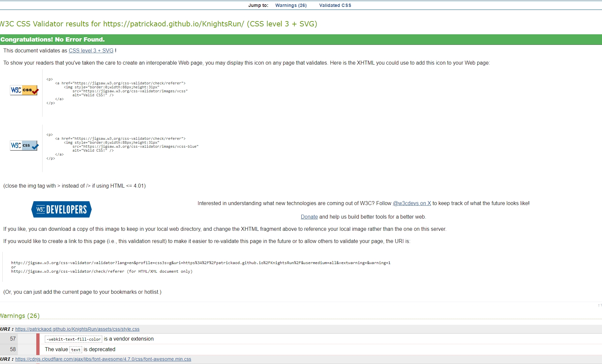

# Testing

> [!NOTE]  
> Return back to the [README.md](README.md) file.

## Code Validation

### HTML

I have used the recommended [HTML W3C Validator](https://validator.w3.org) to validate all of my HTML files.

| Directory | File | Screenshot | Notes |
| --- | --- | --- | --- |
|  | index.html |  | All successful|

### CSS

I have used the recommended [CSS Jigsaw Validator](https://jigsaw.w3.org/css-validator) to validate all of my CSS files.

| Directory | File | Screenshot | Notes |
| --- | --- | --- | --- |
| assets | style.css |  | All successful. There were 26 warnings. Only two referred to the codebase. The other 24 referred to Font Awesome. The background clip was necessary for the text effect, but I was able to remove the vendor extention warning.|
| assets | style.css |  | All successful, with one less warning.|

### JavaScript

I have used the recommended [JShint Validator](https://jshint.com) to validate all of my JS files.

| Directory | File | Screenshot | Notes |
| --- | --- | --- | --- |
| assets | background.js |  | All successful |
| assets | collisionAnimation.js |  | All successful |
| assets | enemies.js |  | All successful |
| assets | floatingMessages.js |  | All successful |
| assets | input.js |  | All successful |
| assets | main.js |  | All successful |
| assets | player.js |  | All successful |
| assets | playerStates.js |  | All successful |
| assets | ui.js |  | All successful |

## Browser Compatibility

Testing a live or deployed site on multiple browsers helps ensure all deployed features function for the end user experience.   

I've tested my deployed project on multiple browsers to check for compatibility issues.

| Browser | Index | Notes |
| --- | --- | --- |
| Chrome |  | |
| Firefox |  | |
| Edge |  | |

