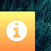

# Testing

> [!NOTE]  
> Return back to the [README.md](README.md) file.

## Code Validation

### HTML

I have used the recommended [HTML W3C Validator](https://validator.w3.org) to validate all of my HTML files.

| Directory | File | Screenshot | Notes |
| --- | --- | --- | --- |
|  | index.html |  | All successful|

### CSS

I have used the recommended [CSS Jigsaw Validator](https://jigsaw.w3.org/css-validator) to validate all of my CSS files.

| Directory | File | Screenshot | Notes |
| --- | --- | --- | --- |
| assets | style.css |  | All successful. There were 26 warnings. Only two referred to the codebase. The other 24 referred to Font Awesome. The background clip was necessary for the text effect, but I was able to remove the vendor extention warning.|
| assets | style.css |  | All successful, with one less warning.|

### JavaScript

I have used the recommended [JShint Validator](https://jshint.com) to validate all of my JS files.

| Directory | File | Screenshot | Notes |
| --- | --- | --- | --- |
| assets | background.js |  | All successful |
| assets | collisionAnimation.js |  | All successful |
| assets | enemies.js |  | All successful |
| assets | floatingMessages.js |  | All successful |
| assets | input.js |  | All successful |
| assets | main.js |  | All successful |
| assets | player.js |  | All successful |
| assets | playerStates.js |  | All successful |
| assets | ui.js |  | All successful |

## Browser Compatibility

Testing a live or deployed site on multiple browsers helps ensure all deployed features function for the end user experience.   

I've tested my deployed project on multiple browsers to check for compatibility issues.

| Browser | Index | Notes |
| --- | --- | --- |
| Chrome |  | |
| Firefox |  | |
| Edge |  | |

## Responsiveness

Testing a live or deployed site on multiple devices helps ensure consistent and high-quality user experiences.

I've tested my deployed project on multiple devices to check for responsiveness issues.

| Device | Index | Notes |
| --- | --- | --- |
| Mobile (DevTools) |  | |
| Tablet (DevTools) |  | |
| Desktop (DevTools) |  | |
| XL Monitor (DevTools) |  | |
| 4K Monitor (DevTools) |  | |
| Google Pixel 7 (DevTools) |  | |
| iPhone 14 Max (DevTools) |  | |

## Lighthouse Audit

I've tested my deployed project using the Lighthouse Audit tool to check for any major issues.

| Page | Mobile | Desktop | Notes |
| --- | --- | --- | --- |
| Index |  |  | The mobile version was slighlty slower. As expected it had a harder time loading assets. |

## User Story Testing

| User Story | Screenshot |
| --- | --- |
| - As a new site user, I would like to see my score, so that I can feel proud I scored high. |  |
|- As a new site user, I would like to I would like my progress to be saved, so that I can continue later.|  |
|- As a new site user, I would like the controls to be easy to understand and use, so that I can quickly start to play.|  |
|- As a returning site user, I would like to just run though the game, so that I can try different strategies. |  |

## Automated Testing

I have conducted a series of automated tests on my application.

I fully acknowledge and understand that, in a real-world scenario, an extensive set of additional tests would be more comprehensive.

### JavaScript (Jest Testing)

I have used the [Jest](https://jestjs.io) JavaScript testing framework to test the application functionality.

In order to work with Jest, I first had to initialize NPM.

- `npm init`
- Hit `enter` for all options, except for **test command:**, just type `jest`.

Add Jest to a list called **Dev Dependencies** in a dev environment:

- `npm install --save-dev jest`

**IMPORTANT**: Initial configurations

When creating test files, the name of the file needs to be `file-name.test.js` in order for Jest to properly work.

Without the following, Jest won't properly run the tests:

- `npm install -D jest-environment-jsdom`

Due to a change in Jest's default configuration, you'll need to add the following code to the top of the `.test.js` file:

```js
/**
 * @jest-environment jsdom
 */

const { test, expect } = require("@jest/globals");
const { function1, function2, function3, etc. } = require("./script-name");

beforeAll(() => {
    let fs = require("fs");
    let fileContents = fs.readFileSync("index.html", "utf-8");
    document.open();
    document.write(fileContents);
    document.close();
});
```

Remember to adjust the `fs.readFileSync()` to the specific file you'd like you test.
The example above is testing the `index.html` file.

Finally, at the bottom of the script file where your primary scripts are written, include the following at the bottom of the file.
Make sure to include the name of all of your functions that are being tested in the `.test.js` file.

```js
if (typeof module !== "undefined") module.exports = {
    function1, function2, function3, etc.
};
```

Now that these steps have been undertaken, further tests can be written, and be expected to fail initially.
Write JS code that can get the tests to pass as part of the Red-Green refactor process.

Once ready, to run the tests, use this command:

- `npm test`

**NOTE**: To obtain a coverage report, use the following command:

- `npm test --coverage`

## Bugs

> [!NOTE]
>  There are no remaining bugs that I am aware of.

